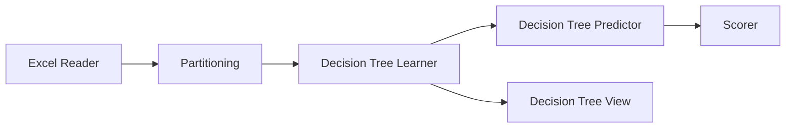

#  Decision Tree

## 📌 Pendahuluan
Workflow ini dibuat menggunakan **KNIME Analytics Platform** dan bertujuan untuk melakukan proses *data mining* menggunakan algoritma **Decision Tree**.

Decision Tree adalah metode klasifikasi yang digunakan untuk memprediksi suatu kelas berdasarkan aturan berbentuk pohon keputusan (tree), yang terdiri dari node, cabang, dan daun (leaf).

---

## 🎯 Tujuan Workflow
Tujuan dari workflow ini adalah:
- Melatih model klasifikasi menggunakan algoritma Decision Tree  
- Menguji performa model terhadap data uji  
- Menampilkan hasil evaluasi model  
- Memvisualisasikan struktur pohon keputusan  

---

## 🔄 Alur Proses Workflow

---

## 🧩 Penjelasan Detail Setiap Node

### 1. Excel Reader

Node Excel Reader digunakan untuk membaca data dari file Excel (.xlsx atau .xls).

Konfigurasi utama:

- Memilih file Excel sebagai input
- Menentukan sheet yang digunakan
- Menentukan apakah baris pertama sebagai header

Output:

Data tabel (dataset) yang siap diproses

Peran dalam workflow:
Sebagai sumber data utama yang akan digunakan untuk proses training dan testing.

---
### 2. Partitioning

Node Partitioning digunakan untuk membagi dataset menjadi dua bagian, yaitu data latih dan data uji.

Konfigurasi utama:

Rasio pembagian data (misalnya 70% training, 30% testing)
Metode sampling (random atau stratified)

Output:

Port 1: Training data
Port 2: Testing data

Peran dalam workflow:
Memastikan model tidak hanya belajar, tetapi juga diuji menggunakan data yang belum pernah dilihat sebelumnya.
---
### 3. Decision Tree Learner

Node Decision Tree Learner digunakan untuk membangun model klasifikasi berbasis pohon keputusan.

Konfigurasi utama:

- Menentukan atribut target (label/kelas)
- Menentukan kriteria pemisahan (misalnya Gini Index atau Information Gain)
- Mengatur kedalaman maksimum pohon (max depth)

Output:

Model Decision Tree

Peran dalam workflow:
Melatih model berdasarkan data training untuk menemukan pola dan aturan klasifikasi.
---
### 4. Decision Tree Predictor

Node Decision Tree Predictor digunakan untuk menerapkan model yang telah dibuat ke data testing.

Konfigurasi utama:

- Menghubungkan model dari Learner
- Menggunakan dataset testing sebagai input

Output:

Data testing yang sudah ditambahkan kolom hasil prediksi

Peran dalam workflow:
Menghasilkan prediksi berdasarkan model Decision Tree.
---
### 5. Scorer

Node Scorer digunakan untuk mengevaluasi performa model klasifikasi.

Konfigurasi utama:

Menentukan kolom actual (label asli)
Menentukan kolom predicted (hasil prediksi)

Output:

- Confusion Matrix
- Accuracy
- Precision
- -Recall

Peran dalam workflow:
Menilai seberapa akurat model dalam melakukan prediksi.
---
### 6. Decision Tree View

Node Decision Tree View digunakan untuk menampilkan visualisasi dari model Decision Tree.

Fitur utama:

- Menampilkan struktur pohon
- Menampilkan aturan keputusan (rule)
- Menunjukkan atribut yang digunakan pada setiap percabangan

Output:

Visualisasi pohon keputusan

Peran dalam workflow:
Mempermudah pengguna dalam memahami cara kerja model Decision Tree.
---
### Kesimpulan

Workflow ini menunjukkan proses lengkap dalam pembuatan model machine learning menggunakan algoritma Decision Tree, mulai dari input data hingga evaluasi model.

Langkah-langkah utama:

Membaca data
Membagi data
Melatih model
Melakukan prediksi
Mengevaluasi hasil
Visualisasi model

Dengan workflow ini, pengguna dapat memahami bagaimana model klasifikasi dibangun dan diuji secara sistematis.
---