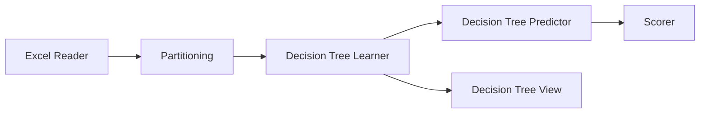

# 📄 Penjelasan Workflow KNIME – Decision Tree

## 📌 Pendahuluan
Workflow ini dibuat menggunakan **KNIME Analytics Platform** dan bertujuan untuk melakukan proses *data mining* menggunakan algoritma **Decision Tree**.

Decision Tree adalah metode klasifikasi yang digunakan untuk memprediksi suatu kelas berdasarkan aturan berbentuk pohon keputusan (tree), yang terdiri dari node, cabang, dan daun (leaf).

---

## 🎯 Tujuan Workflow
Tujuan dari workflow ini adalah:
- Melatih model klasifikasi menggunakan algoritma Decision Tree  
- Menguji performa model terhadap data uji  
- Menampilkan hasil evaluasi model  
- Memvisualisasikan struktur pohon keputusan  

---

## 🔄 Alur Proses Workflow

---

## 🧩 Penjelasan Detail Setiap Node

### 1. Excel Reader

Node Excel Reader digunakan untuk membaca data dari file Excel (.xlsx atau .xls).

Konfigurasi utama:

- Memilih file Excel sebagai input
- Menentukan sheet yang digunakan
- Menentukan apakah baris pertama sebagai header

Output:

Data tabel (dataset) yang siap diproses

Peran dalam workflow:
Sebagai sumber data utama yang akan digunakan untuk proses training dan testing.

---